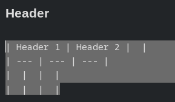
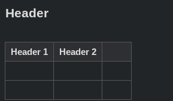
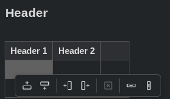

# Visual Tables

A [Joplin](https://joplinapp.org/) plugin that renders tables as real, styled tables directly inside the Markdown editor — and lets you edit them visually without leaving the editor.

Instead of staring at raw `| --- | --- |` syntax, you see a proper table. Click a cell to jump straight into editing, use hover controls to add rows and columns, or right-click for a full set of table operations.

> Desktop only. Requires Joplin **3.5+**.

## Features

- **Live table rendering** — tables are rendered as `<table>` elements inside the Markdown editor (CodeMirror 6), styled to match your Joplin theme.
- **Cursor-aware editing** — the table a cell belongs to turns back into raw Markdown the moment your cursor or selection touches it, so it always stays fully editable as text.
- **Click to edit a cell** — click any rendered cell and the caret lands exactly inside that cell's Markdown source.
- **Hover controls to grow the table**
  - **＋** appears at the right edge to add a column;
  - **＋** appears at the bottom edge to add a row;
  - controls reveal themselves contextually as the mouse approaches the corresponding edge.
- **Right-click context menu** with an icon toolbar:
  - Insert row above / below
  - Insert column left / right
  - Clear cell
  - Delete row / Delete column
  - The clicked cell is highlighted while the menu is open so you can see what the action applies to.
- **Toolbar button** — an *Insert table* button in the Markdown editor toolbar inserts a ready-to-fill table template.
- **Theme-aware styling** — all colors come from Joplin editor CSS variables, so tables and menus follow your light/dark theme.
- **Robust parsing** — tables are detected from the editor's syntax tree (Lezer Markdown), empty cells are handled correctly, and escaped pipes (`\|`) inside cells are respected.

## Usage

### Insert a table

Click the **Insert table** button in the Markdown editor toolbar. A starter table is inserted at the cursor:

```markdown
| Header 1 | Header 2 |
| --- | --- |
|  |  |
|  |  |
```

### Rendering

Tables are rendered as <table> elements inside the Markdown editor \(CodeMirror 6\)

<p align="center">
  
  &nbsp;&nbsp;&rarr;&nbsp;&nbsp;
  
</p>

### Edit a cell

Click any cell in a rendered table — the table switches to raw Markdown and the cursor is placed inside the cell you clicked. Move the cursor out of the table and it renders again automatically.

### Add rows and columns

Hover over a rendered table:

- move toward the **right edge** to reveal the *add column* button;
- move toward the **bottom edge** to reveal the *add row* button.

### Row / column operations

**Right-click** any cell to open the icon toolbar:

<p align="center">
  
</p>

| Icon group | Actions |
| --- | --- |
| Rows | Insert row above, Insert row below |
| Columns | Insert column left, Insert column right |
| Cell | Clear cell |
| Delete | Delete row, Delete column |

Some actions are disabled when they would break the table (e.g. you can't delete the last column, and the header / delimiter rows can't be removed). Hover an icon to see its tooltip.

## How it works

The plugin registers a **CodeMirror 6 content script** (`ContentScriptType.CodeMirrorPlugin`). It:

- finds tables via the editor's Lezer Markdown syntax tree;
- replaces each table block with a rendered widget using a `StateField`-backed `DecorationSet` (block/replace decorations must come from a state field in CM6, not a view plugin);
- skips rendering for any table that intersects the current selection, keeping it editable;
- applies edits as single CodeMirror transactions computed from positions in the syntax tree, so the underlying Markdown formatting is preserved.

> The plugin only activates in the CodeMirror 6 Markdown editor. In the legacy editor it does nothing.

## Installation

### From the Joplin plugin repository

1. Open Joplin → **Tools → Options → Plugins**.
2. Search for **Visual Tables**.
3. Click **Install** and restart Joplin.

### Manual installation

1. Download the latest `.jpl` from the [releases](https://github.com/eugene-lesnov/joplin-plugin-visual-tables/releases).
2. Open Joplin → **Tools → Options → Plugins**.
3. Use the gear/⚙ menu → **Install from file** and select the `.jpl`.
4. Restart Joplin.

## Building from source

```bash
npm install
npm run dist
```

## License

MIT
